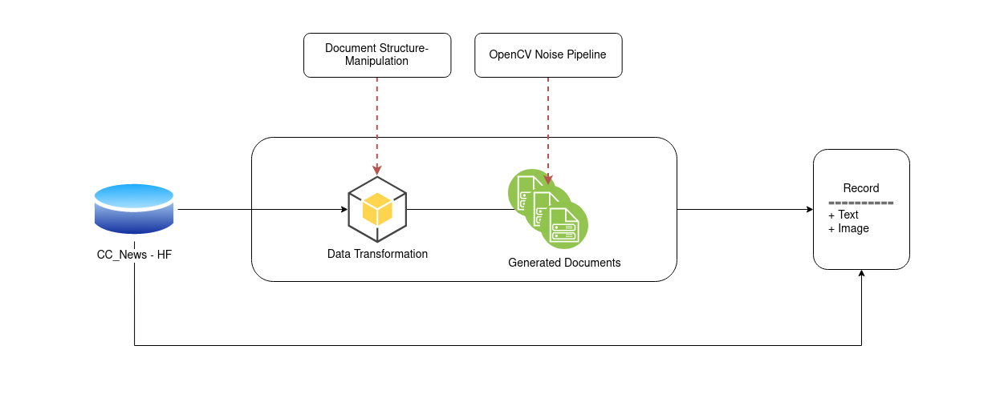

# Document Based Generative Data Augmentation

## Introduction
Optical Character Recognition(OCR), is a machine learning and computer vision based mechanism for translating human readable text present in images to digital encoded text. In order to appropriately train these systems for general use, a large amont of manual annoation and computational overhead are required. Examples of these requirements include segmenation tagging, manual document translation, and document preprocessing. There are many studies addressing making the most out of the pubically avaible datasets tailored towards training translative text tasks including consistency regularization, data augmentation, machine learning driven signal preprocessing. 

This study addresses creating large volume, annotated, custom documents from tabular data, traditionally used for training Large Language Models(LLMs) to provide more general flexiblity. We explore transforming the cc_news dataset from the huggingface data repository into plan text news articles with varying levels of preprocessing built in for the downstream use of improving text extraction learning tasks. We begin by exploring the components of structurally creating a generative pattern for our documents using the FPDF2 opensource library, then applying a combiniation of common scanned document irregularities; i.e.: whitespace segmentation, special character insertion, document resolution, and font. Through this process we aim to generate a dataset that we can use to evaluate the performance of varying document extraction engines and gain a performance profile with less manual overhead associated with document collection and preprocessing.

## Methods

In most practical cases, generative data augmentation is performed on an array of multimodal data sources; including audio, image, and plain text. In the context of our case study, we explore approaches for genrating the samples using the latter two approaches. We compare the qualitative output of these samples and their feasibility of use against a template controlled version of the data re-inacting most common occuring errors during document translation. We include parameters such as font size, image resolution, character encoding conflict, and page segmentation.
 
### Matierals
 
| Resource      | Description | Parameters |  
| ----------- | ----------- | ----------- | 
| CC News Dataset| Dataset from hugginface data repository| Random Select range(3_000)| 
| Tesseract OCR Engine |Text Extraction Engine| --psm 6 segmentation mode |
|Cuneiform OCR Engine| Text Extraction Engine| single page segmentation mode |
|FPDF2 Library| Programatic API for generating formatted PDF documents from plain text| discussed in methods |
|Byt5-small LLM| Tokenless Byte Based Transformer| Parameters in model section| 
### Overview of Generic Document Generation Pipeline

**Data Ingestion**
We begin by ingesting a large data source domain agnostic text source that behaves with general use text procesing tools without fine-tuning. For this task we select news data from the cc_news dataset in huggingface's data  repository. We selected this data source for the provided summarization and manual annotation already performed on this dataset to support downstream learning tasks to analyze the quality of augmentations against an established benchmark. In order to ingest this dataset we leveraged the datasets native API for general control and use of computation resources--further study can be done to figure out the optimial parallelization scheme for increasing performance at ingestion time by leveraging the spark or polars API's.

**Transformation**
The advantage gained by leveraging the multimodal capabilities of an OCR engine to generate the output of our text instead of generating it ourselves is that the control mechanism of document templating. We leverage the FPDF2 library to solidify a general use template for producing our plain text image documetns with tunable,  object distinct,  creation parameters. These object indepenent parameters include shared instance traits such as font size, resolution, and spacing. Whereas obejct dependent parameters include document shape,  page segmentation, and layout imperfections. We generate these templates with increasing layers of complexity by leveraging the PDF object in the FPDF2 library and applying the abstract factory method on top of it to generate out complex documents.

**Generating Common OCR Error Types**
The objective of this case study is heavily dependent on not only the number of errors encountered by reproducing system noise, but also the quality of the noise generated. Previous approaches to this method incorperate attaching generative noise by way of random sampling and insertion/deletion at the inference level of a corrective system; whereas other corrective method lacking probalistic inference capability, but definative rule sets for varying types of errors encountered while performing manual text processing techniques. We start by analyzing

**Document Generation**
Document generation serves as the final step for our objective. We use the preprocessing steps we sequentially layout for each task to create a simple document then generate them in the form of plain text articles with the plain displayed text we desire alongside a metadata entry where we have subclassification information on each document along with the true text associated with our generated images.

### Metrics
Our overall objective for evaluating this method is by comparing the quality of errors to approaches including NLP aug random error insertion and TSDAE random noise generation. Below include the following use cases for evaluation.

**ANOVA**
This metric is meant to observe whether there is an influence on introducting qualitative noise opposed to random and the behvior varying subsets of a distribtion experience due to the change in noise type. We explore between group variability, shift in mean, and distribution variability. 