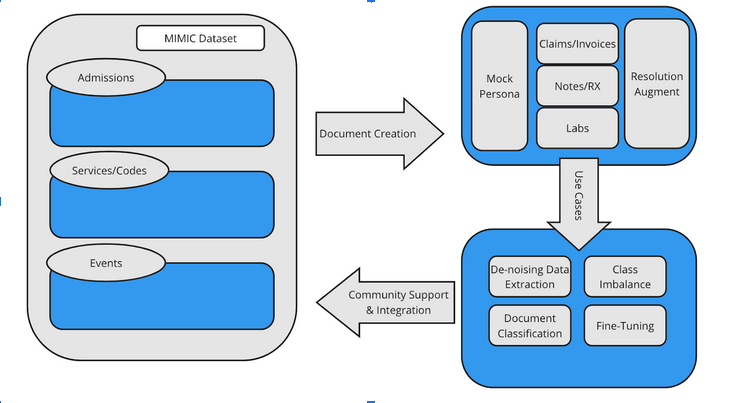
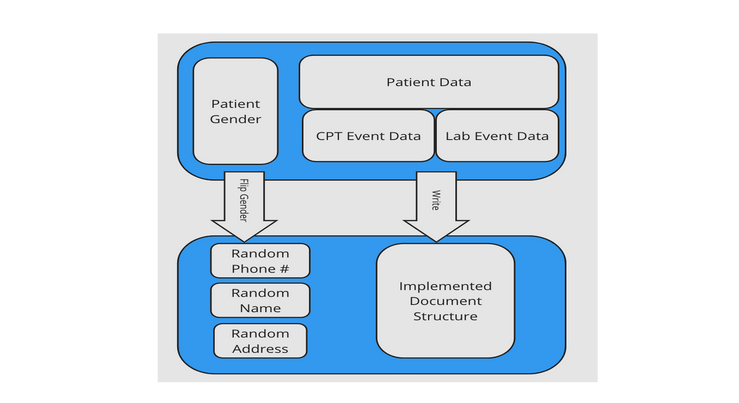
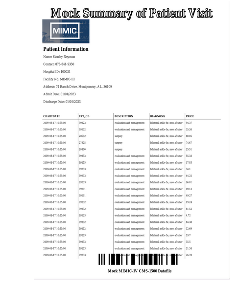

# MIMIC-IV MocDocs: Publicly Available Mock Documents for Accelerated Clinical Language Processing Prototypes
## Introduction
Within the clinical healthcare space, upwards eighty percent of data exists in the form of unstructured manually entered information. Most of this data(i.e.: text, images, etc..) goes unused and is eventually buried in large repositories that are eventually offloaded and discarded. A pivotal roadblock integrating current natural language processing techniques into 
the healthcare domain is the lack of open source support and general public access to data other public domains have. This allows for crowdsourced support regarding integration of tooling, methods, and pre-trained large language models(LLMs) to be accessible to the general public. In an effort to address the public availability to researchers, the MIMIC critical care database was published. Further work to leverage the data for language modeling was done on the clinical text within this database  to generate publicly available, pretrained language models to gather a community around further adapting state of the art language processing techniques for optimizing healthcare applications. Given the large amount of unstructured data sources health records are generated and entered–most commonly fax or scanned images, large amounts of image preprocessing, text correction, and quality checks are required to leverage this data within the traditional realm of applied machine learning and artificial intelligence. This paper proposes an extension of the MIMIC-III and MIMIC-IV databases by publishing mock electronic health records that reflect most commonly processed formats such as the center of medicare and medicaid services(CMS) for health records processing in payment and provider institutions. We recreate patient notes, claims, and laboratory documents in the form of plain images that serve as a means of access to modifiable reproducible documents to further support the optimization of reliable text extraction for clinical natural language processing.

This study reviews the structural components necessary for creating a minimal functioning document, the observation axis necessary to leverage the MIMIC clinical databases to do so, and various mediums of augmentation opportunities to introduce common cosmetic flaws that surface in real-world private systems. As the healthcare industry adopts product centric and service oriented approaches around their vast volumes of data, the necessity to rapidly evaluate intelligent approaches surfaces. The most common methods of data processing for facilitating the digitalization of legacy health records are optical character recognition and manual data entry. As the field of natural language processing continues exploration in deep learning techniques to better create more fault tolerant architectures for understanding human language through massive samples of public data from social media platforms, advertising agencies, and consumer products, an opportunity to create an even larger gap between precision health research and public domains presents itself. 

## Methods
MIMIC versions III and IV are clinical care databases that have gone through deidentification, transformation and re-modeling in the form of modules for various layers of observation. We leverage the relational structure of the database in order to create a generative layer for promoting clinical document mocking and augmentation. With the fast-paced adoption of clinical data systems in the healthcare industry, many legacy infrastructures require either manual data correction and large scale document ingestion. The intention of these systems is to convert large repositories of documented information into a format that processing systems can interpret, transform, and model for downstream application use. Due to the closed nature of many of these repositories, approaches regarding the implementation of intelligent, corrective ingestion are left solely on the organizations where the resources to appropriately tackle this problem may not be available.  We aim to open this closed system, but integrating a publicly supported adaptation to insert into the workflow of industry researchers and engineers.

The following section reviews the set of actions taken in the ingestion, transformation, and selection of augmentation parameters used to achieve mocking clinical scanned documents.

**Data Ingestion.** The initial implementation of MIMIC-IV “mock-docs” delivers two sources of unstructured mocs; the first being CMS-1500 structured medical invoice data tables, and the other being free text clinical lab reports. In order to recreate these documents, the Admissions table is the primary modeling target for information synthesis. By grouping unique patient visits by their admission status, diagnosis, and insurance provider, we map CPT events and Lab events to create a mock generative persona(fake patient info associated with an admit identification number) for each document. The programmatic manipulation of data is done via the polars api which supports columnar data structures and supports parallelism at the column level for faster retrieval and processing of the staging tables. Alternatively the native interface of SQL(structured query language) for re-application of these methods can also be implemented.

**Transformation** The true value in the MIMIC database is the flexibility in design and relational structure. This allows researchers to simultaneously observe the infrastructure of patient care at various levels of granularity and model data needs towards their downstream use cases. For generating mock documents we aggregate the Admissions table with the CPT Events table, joining and grouping by their admission id to recreate sequential billing lines for table entry. Their information is then assigned a randomly generated persona using 1990’s census data, and contact information derived from the open address dataset. We chose a persona generation approach with a multi-decade gap, re-assignment of gender, and random contact assignment  for data entry to decrease the already statistically low likelihood of a real collision of data to uphold the integrity of patient de-identification establish the HITECH Act further extending on patient rights to privacy established by  HIPAA. An example of a randomly generating persona for billing is included in the figure below.

**Document Generation** The concept of mocking not only extends from the patient persona, but also to the physical copy of the document. Having the ability to recreate various cosmetic flaws and documents as a safeguard around PHI compliant documents serves as a secondary transformative stage. The documents are generated using the mock document tabular data structure post transformation and assigned various parameterized design characteristics that allows for each persona to be represented in the same heterogenous fashion they would be when generated from a provider institution or lab. The implementation used to perform this operation is by taking each row level data entry and aggregating each line item associated with a patient visit to a billing invoice table. Using this information, we provide various augmented samples of the data that cause data translation errors in intelligent data processing systems; Optical Character Recognition Engines, Text-to-Text Transformers, etc. For this experiment, we expand on the CMS-1500 billing invoice data structure and plain text prescriptions by augmenting the image size, resolution, and segmentation level at the generative level of the mocking process.

