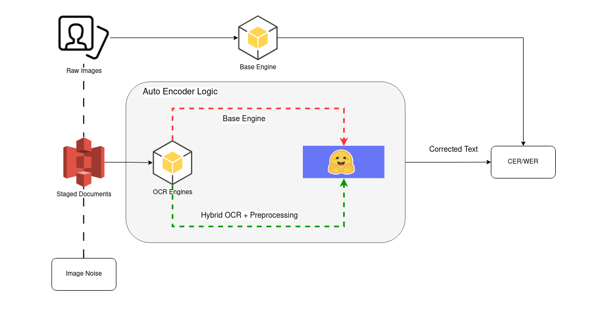

# Consistency Driven Meta-Learning For Sequence to Sequence Transformers

### Introduction

General purpose Optical Character Recognition(OCR) Engines are responsible for translating heterogeneous, scanned and printed documents into machine readable digital text. In the process of converting an image over to text the most common errors in digital translation are caused by the cosmetic defects within the image, irregular page segmentation level, and overall image quality. In order to navigate these challenges, yielding more reliable results, OCR engines often are accompanied by pre and post processors in the form of text extraction pipelines. These pipelines consist of an image to image de-noising preprocessor, a neural or transformer architecture based OCR engine, and a text to text correction mechanism to adjust erroneous output. Traditionally these components independently trained and regularized on their specific roles; however this paper covers the modularization each of these tasks to be implemented in the same architecture by leveraging transfer learning to create a robust auto-encoder-based transformer to achieving a modular approach to generalizing preprocessing tasks by transferring the properties of one document processing engine to another. We aim to show:

> 1.The properties of modular transfer learning can serve as an semi-supervised pre-training method for language understanding.
> 2\. Leveraging two OCR engines can act as a form of adversarial consistency regularization for improving system performance.

### Methods

The proposed implementation of this corrective method incorporates mapping the output of a bare OCR engine and a more robust preprocessor facing engine. For the case of this experiment we leverage the Cuneiform and Tesseract OCR engines. The auto-encoder we implement this approach with is the tokenless version of the T5 architecture, known as Byt5, by Google research. We select Byt5 mostly because of its tokenless nature, which works efficiently at the character level which stabilizes the potential variation in output each engine has and how overall high dimensional mapping process will take place. This allows us to leverage the attention based mechanism built into the text to text transformer architecture to account for character flaws, as well as common patterns encountered during the preprocessing phase of the pytesseract pipeline in at the singular character level.

The figure below represents the overall training scheme we use for leveraging de-noising for learning the traits of a more robust OCR engine and its preprocessing steps given the same image.

#### Overview of De-Noising Transfer and Task Scoring

#### Training Objective

Due to our goal being to minimize the predictive error between our two our two OCR engines given our raw document corpus, we aim to treat our objective function like any other regression problem with the goal of minimizing our error. Unlike most regression problems, our goal is to learn over an extremely dense high dimensional space while capturing meaningful context often bypassed by traditional high dimensional regression approaches by using to the attention based mechanism of transformer architectures.
Our generic Mean Squared Error is defined such that:

> MSE = $\dfrac{1}{N} \sum_{n}^{N}(y_n - \hat{y}_n)^2$
> Where $\hat{y}$ is the predicted output of our generic OCR mapping and $y$ is our targeted robust OCR engine.

#### Scoring and Evaluation

We begin by determining the exact axis of observation used in this experiment. Due to the nature of our proposed approach we must account for both the overall performance gain at the work/token level as well as the line level; partially to the segment nature of the extraction engines chosen. Due to this constraint we propose the following two metrics as our baseline for evaluating the feasibility of this experiment; the two being Character Error Rate(CER) and Word Error Rate(WER). These two metrics are insightful for this experiment because we would like to compute how well character insertion and deletion rates change in relation to our ground truth engine as well as how well whole line items perform during this process. We propose using two Levenshtein derived error rates over granularity levels of our OCR data; the world word and line level.

We start by defining the dynamic components of what the Levenshtein edit distance equation accounts for when distinguishing the difference between two strings. We have the following transformations:

1.  Insertions: Represented as extra characters inserted into a string in relation to the observed parent string used in this dynamic comparison.
2.  Deletions: Represented as missing characters removed from a string in relation to the observed parent.
3.  Substitutions: A string can remain of the same length as the observed parent string, but have nonequivalent characters. This is generally referred to as a substitution.
    We express these transformations within the context of our error rate equation as follows:

- S: number of character substitutions
-  D: number of character deletions
- I: number of character insertions
- Z: any arbitrary text transformation for observation
- N: number of samples
> Where each sample point and granularity level is defined by the task assigned; i.e.: character error rate vs Word Error Rate vs Line Error Rate, etc.

> We propose a generic error rate such that our rate ERR can be expressed as

> ERR = $\dfrac{\sum_{i=0}^{I}T_i}{N}$;

> Where T is a set of potential transformations that are observed in our desired dynamic string comparison algorithm; in our case, Levenshtein Edit Distance, where T represents a set of transformations

> T = {S, D, I..., Z}

> **Character Error Rate** serves as a character to character dynamic mapping of how well each character is translated during document extraction. This acts as the lowest level of granularity we can statistically achieve using our tokenless transformer based approach and is broken down word by word at the evaluation level. The error rate can be computed as such that:

> > Where each observation is at the character/btye level
> > CER = $\dfrac{\sum_{i=0}^{I}T_i}{N}$; T = {S, D, I..., Z}
> 
> **Word Error Rate** serves as a sequence to sequence measurement of how well each word in a particular line of text is represented during document extraction. For general use and extension into sequence to sequence prediction in language modeling tasks, the word level serves as the primary level of granularity; i.e.: word insertion, masked language modeling, sequence to sequence translation. Being able to measure the overall representation of line level text can be computed as:

> > N: number of samples
> > Where each observation is at the word/token level
> > WER = $\dfrac{\sum_{i=0}^{I}T_i}{N}$; T = {S, D, I..., Z}